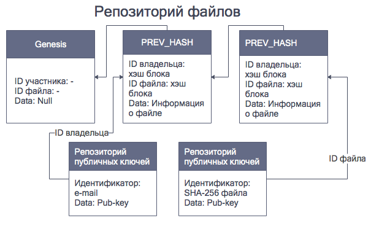

- title : Хакатон
- description : Introduction to React Native with F#
- author : Беляков Алексей, Подрезов Александр, Чудаков Тимофей
- theme : night
- transition : default

***

 
 

## Blockchain для передачи файлов
 
 
Команда DM
 
НОЯБРЬ 2018

***

## Первичная регистрация участников.

 

---

*   Генерация приватного и публичного ключей участника
*   Создание нового блока и добавление его в репозиторий публичных ключей
'   Отправка информации в подсеть о своем присутствии

---

' *   Блок содержит
'   *   уникальный hash пользователя
'    *   Идентификатор: e-mail пользователя
'    *   публичный ключ пользователя 
    

***

## Регистрация интеллектуальной собственности.

---

* Генерация публичного и приватного ключа для файла
    

---

* Шифрование файла публичным ключом
* Добавление публичного ключа в репозиторий публичных ключей. Идентификатор: хэш файла
* Добавление информации о файле в репозиторий файлов

---

###

 

*** 

## Механизм взаимодействия между участниками сети.

---

* Заинтересованный участник, регистрирует свое желание в получении файла, создавая запись в репозитории контрактов. Производится холдирование средств.

--- 

* После загрузки и проверки файла, получатель создает очередной блок в котором регистрирует информацию о том, что файл им полностью получен
* Данный блок является фиксацией того, что файл получен, и того, что получатель ждет от владельца ключ доступа к файлу.

---

* Владелец файла, получив информацию о полной загрузке файла получателм, создает следующий блок в который помещает информацию с приватным ключом к файлу, зашифрованным публичным ключом получателя. 

---

* Получатель информации фиксирует в репозитории факт получения ключа.

***

### Спасибо за внимание!

---

##Справочная информация

* https://www.ibm.com/blogs/blockchain/2018/05/securing-your-cross-domain-file-transfers-with-blockchain/
